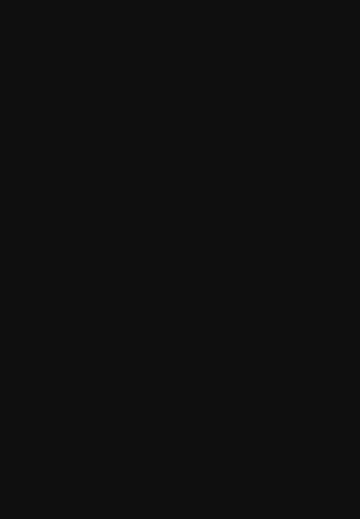

# TaskFlow


Aplicación sencilla para administrar tareas de un equipo[cite: 1].

## Tabla de contenidos
- [Descripción](#descripción)
- [Funcionalidades](#funcionalidades)
- [Tecnologías utilizadas](#tecnologías-utilizadas)
- [Requisitos](#requisitos)
- [Instalación](#instalación)
- [Uso](#uso)
- [Capturas de pantalla](#capturas-de-pantalla)
- [Arquitectura](#arquitectura)
- [Estructura del proyecto](#estructura-del-proyecto)
- [Contribuidores](#contribuidores)
- [Licencia](#licencia)

## Descripción
TaskFlow es una plataforma de gestión diseñada para equipos de desarrollo. Facilita el seguimiento de actividades, optimizando la interacción del usuario y manteniendo un registro de actividad detallado.

## Funcionalidades
- [x] Registrar tareas[cite: 1]
- [x] Editar tareas[cite: 1]
- [ ] Eliminar tareas[cite: 1]
- [ ] Asignar tareas a usuarios[cite: 1]

## Tecnologías utilizadas
| Componente | Tecnología | Uso Específico |
|------------|------------|----------------|
| Frontend   | React      | Interfaces de usuario |
| API        | Node.js    | Lógica de negocio e integraciones |
| DAO        | MySQL      | Persistencia de datos |

## Requisitos
* Entorno de ejecución Node.js (v14 o superior)
* Servidor MySQL local o remoto
* Git Bash para el control de versiones

## Instalación
1. Clonar el repositorio.[cite: 1]
   ```bash
   git clone [https://github.com/usuario/taskflow.git](https://github.com/usuario/taskflow.git)
   ```
2. Configurar la base de datos.[cite: 1]
3. Configurar las variables necesarias.[cite: 1]
4. Ejecutar la aplicación.[cite: 1]
   ```bash
   npm install
   npm start
   ```

## Uso
Una vez ejecutada la aplicación, accede mediante tu navegador web a la ruta local. Ingresa con tus credenciales en la pantalla de inicio de sesión para acceder a la gestión central de tareas.

## Capturas de pantalla

### Pantalla principal
[cite: 1]

### Pantalla de registro o inicio de sesión
[cite: 1]

### Gestión de tareas
[cite: 1]

## Arquitectura
La aplicación está organizada en diferentes componentes que permiten gestionar la interacción con el usuario, la autenticación, el acceso a datos y el registro de actividades[cite: 1].

```mermaid
flowchart LR
    U[Usuario] --> F[Frontend][cite: 1]
    F --> API[API][cite: 1]
    API --> AUTH[Autenticación][cite: 1]
    API --> DAO[DAO][cite: 1]
    DAO --> DB[(MySQL)][cite: 1]
    API --> LOG[Registro de actividad][cite: 1]
```

## Estructura del proyecto
```text
proyecto/
├── docs/
│   └── img/
│       ├── inicio.png
│       ├── login.png
│       └── tareas.png
├── src/
└── README.md
```

## Contribuidores
* **Anthony Palomino Bernales** - *Desarrollador Principal y Documentación*

## Licencia
Este proyecto se distribuye bajo la Licencia MIT.