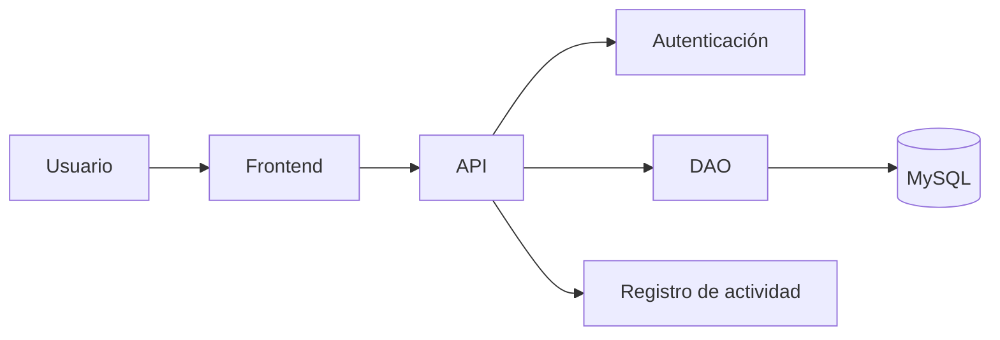

# TaskFlow

Aplicación para administrar tareas.

## Tabla de contenidos

- [Descripción](#descripción)
- [Funcionalidades](#funcionalidades)
- [Tecnologías](#tecnologías)
- [Requisitos](#requisitos)
- [Instalación](#instalación)
- [Uso](#uso)
- [Capturas de pantalla](#capturas-de-pantalla)
- [Arquitectura](#arquitectura)
- [Contribuidores](#contribuidores)

## Descripción
TaskFlow es una aplicación diseñada para facilitar la administración de tareas dentro de un equipo, optimizando el seguimiento de las actividades diarias.

## Funcionalidades

- [x] Registrar tareas
- [x] Editar tareas
- [ ] Eliminar tareas
- [ ] Asignar tareas a usuarios

## Tecnologías

* HTML, CSS, JavaScript
* Backend API
* Base de datos MySQL

## Requisitos

* Navegador web moderno
* Entorno de ejecución para el Backend
* Gestor de base de datos relacional

## Instalación

1. Clonar el repositorio.
2. Configurar la base de datos.
3. Configurar las variables necesarias.
4. Ejecutar la aplicación.

## Uso
Inicia sesión en la plataforma y utiliza el panel principal para gestionar y dar seguimiento a las tareas del equipo.

## Capturas de pantalla

### Pantalla principal

### Pantalla de registro o inicio de sesión

### Gestión de tareas

## Arquitectura
La aplicación está organizada en diferentes componentes que permiten gestionar la interacción con el usuario, la autenticación, el acceso a datos y el registro de actividades.

## Contribuidores
- Equipo de Desarrollo de TaskFlow